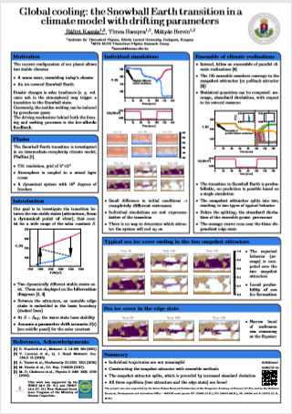
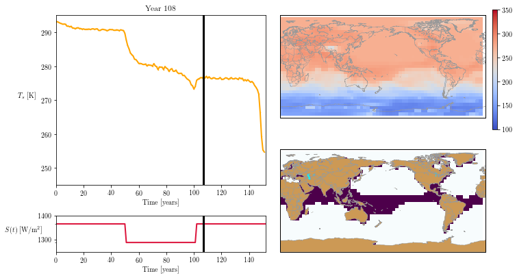
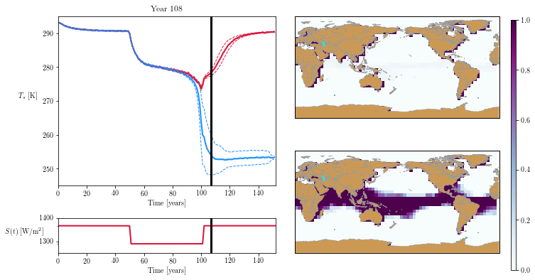

# Global cooling: the Snowball Earth transition

<table class="wide">
<tr>
  <td class="left">
    
</tr>
<tr>
  <td class="left">
    
  </td>
  <td class="right">
    
  </td>
</tr>
</table>

### In the project, the climate model PlaSim was used. This is an intermediate-complexity general circulation model developed at the University of Hamburg. Download the source from <a href = "https://github.com/HartmutBorth/PLASIM">GitHub </a>.

  

      <ul class="nav">
          <li><a href="posters.html">Previous work</a></li>
      </ul>
  

